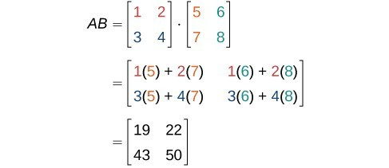

**Problem Description**

You are given two integer matrices **A** (having **M X N** size) and **B** (having **N X P** ). You have to multiply matrix **A** with **B** and return the resultant matrix. (i.e. return the matrix **`AB`** ).


**Problem Constraints**

1 <= **M, N, P** <= 100

-100 <= **A[i][j], B[i][j]** <= 100

**Input Format**

There are 2 lines in the input
First line: Two integers R, C are the number of rows and columns. Then R _ C integers follow corresponding to the rowwise numbers in the 2D array.
Second line: Two integer R, C are the number of rows and columns. Then R _ C integers follow corresponding to the rowwise numbers in the 2D array.

**Output Format**

Return a 2D integer matrix denoting **`AB`** .

**Example Input**

Input 1:

```
2 2 1 2 3 4
2 2 5 6 7 8
```

Input 2:

```
1 2 1 1
2 1 2 3
```

**Example Output**

Output 1:

```
 [[19, 22],
  [43, 50]]
```

Output 2:

```
 [[5]]
```

**Example Explanation**

Explanation 1:



Explanation 2:

```
 [[1, 1]].[[2, 3]] = [[1 * 2 + 1 * 3]] = [[5]]
```
